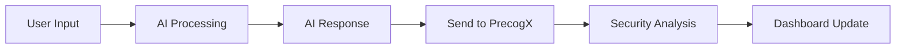

# No-Code Platform Integration

Connect your favorite no-code AI platforms and workflow automation tools to PrecogX for comprehensive security monitoring. No coding required - just configure webhooks and start protecting your AI agents!

## 🚀 Supported Platforms

Choose your platform below for detailed integration guides:

### **Visual AI Workflow Builders**
- 🔵 **[Flowise](./integrations/flowise)** - Drag-and-drop LLM flow builder
  - *Most popular visual AI workflow platform*
  - *HTTP Request node integration*
  - *Custom Function node support*

- 🟣 **[Dify](./integrations/dify)** - Open-source LLM app development platform  
  - *Chat, Agent, and Workflow applications*
  - *Webhook integration*
  - *External service support*

### **Workflow Automation Platforms**  
- 🟠 **[n8n](./integrations/n8n)** - Workflow automation with AI integration
  - *HTTP Request and Code node integration*
  - *Support for OpenAI, Anthropic, and custom AI services*
  - *Advanced error handling and retry logic*

### **Coming Soon**
- 🔜 **Langflow** - Open-source visual flow builder
- 🔜 **Make (Integromat)** - Advanced automation platform  
- 🔜 **Zapier** - Popular automation service

## 🏃‍♂️ Quick Start (All Platforms)

### Step 1: Get Your PrecogX API Key

1. Sign up for a free PrecogX account at [app.precogx.ai](https://app.precogx.ai)
2. Navigate to **Settings** → **API Keys**
3. Click **Create API Key**
4. Copy and securely store your API key

### Step 2: Choose Your Integration Method

Each platform has specific integration methods optimized for its workflow system:

| Platform | Recommended Method | Guide Link |
|----------|-------------------|------------|
| **Flowise** | HTTP Request Node | [View Flowise Guide →](./integrations/flowise) |
| **n8n** | HTTP Request Node | [View n8n Guide →](./integrations/n8n) |
| **Dify** | Webhook Integration | [View Dify Guide →](./integrations/dify) |

### Step 3: Test Your Integration

After following your platform's specific guide:

1. **Run a test workflow** with your AI agent
2. **Check your PrecogX Dashboard** at [app.precogx.ai](https://app.precogx.ai/dashboard)
3. **Verify data appears** in the Agents and Overview sections
4. **Review security detections** for any immediate threats

## 🔧 Common Integration Pattern

While each platform has its specifics, the general pattern is:



**Core API Endpoint:**
```
POST https://api.precogx.ai/api/v1/integrations/{platform}/telemetry
```

**Basic Payload Structure:**
```json
{
  "agentId": "your-agent-identifier",
  "prompt": "user input text",
  "response": "ai response text",
  "metadata": {
    "platform": "platform-name",
    "timestamp": "2024-01-15T10:30:00Z"
  }
}
```

## 🛡️ Security Features

All no-code platform integrations provide these security monitoring capabilities:

### **Real-Time Threat Detection**
- 🚨 **Prompt Injection** - Detect attempts to manipulate AI behavior
- 🔒 **PII Leakage** - Identify sensitive data exposure
- 🚫 **Content Moderation** - Flag inappropriate content
- 🔗 **Malicious Links** - Detect suspicious URLs

### **AI Behavior Monitoring**
- 📊 **Trust Scores** - Dynamic agent reliability metrics
- 🔄 **Behavioral Drift** - Detect unexpected changes in AI responses
- ⚠️ **Tool Abuse** - Monitor function calls and API usage
- 📈 **Performance Analytics** - Track response times and success rates

### **Compliance & Governance**
- 📋 **Audit Logs** - Complete interaction history
- 👥 **Human-in-the-Loop** - Manual review workflows
- 🔔 **Alert System** - Instant notifications via Slack, email, or webhook
- 📊 **Reporting** - Comprehensive security dashboards

## 🆘 Need Help?

### **Platform-Specific Support**
- **Flowise Issues**: [Flowise Integration Guide](./integrations/flowise#troubleshooting)
- **n8n Issues**: [n8n Integration Guide](./integrations/n8n#troubleshooting)  
- **Dify Issues**: [Dify Integration Guide](./integrations/dify#troubleshooting)

### **General Support**
- 📧 **Email**: [support@precogx.ai](mailto:support@precogx.ai)
- 💬 **Chat**: Available in your PrecogX dashboard
- 📖 **Documentation**: [docs.precogx.ai](https://docs.precogx.ai)
- 🐛 **Issues**: Report bugs on our GitHub

## 🚀 Next Steps

After integrating your no-code platform:

1. **[Configure Detection Rules](https://app.precogx.ai/dashboard/settings)** - Customize security thresholds
2. **[Set Up Notifications](https://app.precogx.ai/dashboard/settings/notifications)** - Configure alerts
3. **[Review Analytics](https://app.precogx.ai/dashboard/overview)** - Monitor your AI security metrics
4. **[Explore Advanced Features](https://app.precogx.ai/dashboard/settings/billing)** - Upgrade for additional capabilities

---

**Ready to secure your no-code AI workflows?** Choose your platform above and follow the detailed integration guide!
