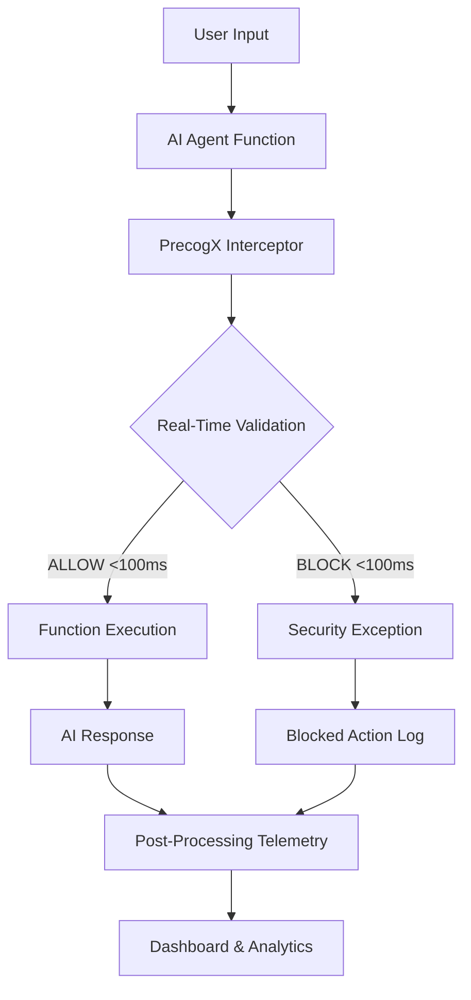
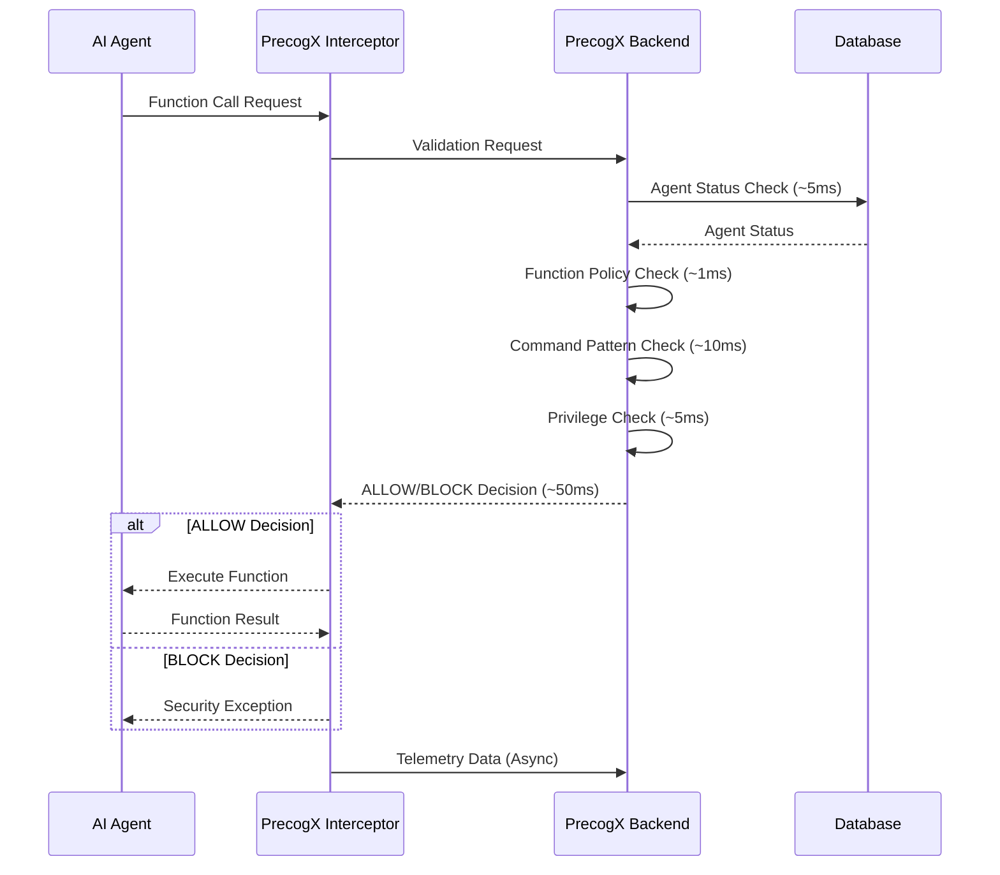

# Real-Time AI Prevention

PrecogX provides **microsecond-level real-time interception** and prevention capabilities that act as an AI firewall, blocking malicious actions before they can execute. This comprehensive security layer works across all integration methods - from SDK to no-code platforms.

## 🚀 What is Real-Time Prevention?

Real-Time Prevention is PrecogX's core capability that **intercepts AI agent actions before execution** and makes instant ALLOW/BLOCK decisions based on security policies. Unlike traditional monitoring that detects threats after they occur, PrecogX prevents threats from happening in the first place.

### Key Characteristics

- **⚡ Sub-100ms Response Times**: All validation decisions complete within 100 milliseconds
- **🛡️ Pre-Execution Interception**: Actions are validated before they execute
- **🎯 Function-Level Security**: Every function call can be intercepted and validated
- **🔄 Real-Time Decision Making**: Instant ALLOW/BLOCK responses from backend
- **🌐 Universal Integration**: Works across SDK, HTTP API, and no-code platforms

## 🏗️ Architecture Overview

## ⚡ Microsecond-Level Performance

### Response Time Breakdown

| Validation Step | Time | Description |
|----------------|------|-------------|
| **Agent Quarantine Check** | ~5ms | Single database query for agent status |
| **Function Policy Check** | ~1ms | In-memory lookup of disallowed functions |
| **Shell Command Check** | ~10ms | Pattern matching for dangerous commands |
| **Privilege Check** | ~5ms | Context-based permission validation |
| **File Operation Check** | ~5ms | Pattern matching for dangerous file ops |
| **Network Overhead** | ~50ms | HTTP request/response latency |
| **Total Response Time** | **<100ms** | Complete validation cycle |

### Performance Optimizations

- **In-Memory Security Rules**: Function blacklists and patterns stored in memory
- **Optimized Database Queries**: Single-query agent status checks
- **Efficient Pattern Matching**: Regex patterns optimized for speed
- **Minimal Network Payload**: Compact request/response formats
- **Connection Pooling**: Reused HTTP connections for low latency

## 🔧 Integration Methods

PrecogX provides real-time prevention across multiple integration approaches, ensuring every AI agent can be protected regardless of how it's built.

### 1. SDK Integration

**Best for**: Custom Python applications, LangChain, LiteLLM

**Capabilities**:
- Decorator-based function wrapping
- Automatic interception of all decorated functions
- Seamless integration with existing codebases
- Exception-based error handling

**Use Cases**:
- Custom AI applications
- LangChain agent workflows
- LiteLLM integrations
- Python-based AI systems

### 2. HTTP API Integration

**Best for**: Custom applications in any language, middleware, proxies

**Capabilities**:
- Direct REST API calls for validation
- Language-agnostic implementation
- Programmatic control over validation timing
- Custom error handling and retry logic

**Use Cases**:
- Multi-language AI applications
- Custom middleware development
- Proxy server implementations
- Existing system integrations

### 3. No-Code Platform Integration

**Best for**: Flowise, n8n, Dify, and other visual workflow platforms

**Capabilities**:
- HTTP Request node integration
- Visual workflow configuration
- Webhook-based validation
- Platform-specific optimizations

**Use Cases**:
- Visual AI workflow builders
- No-code automation platforms
- Rapid prototyping and deployment
- Business user implementations

## 🛡️ Security Validation Rules

PrecogX applies comprehensive security rules during real-time validation to prevent various types of threats.

### Function-Level Protection

**Disallowed Functions**:
- System execution functions (`exec_shell`, `os.system`, `subprocess.run`)
- Code evaluation functions (`eval`, `exec`, `compile`)
- Import manipulation (`__import__`, `globals`, `locals`)

**Protection Scope**:
- Function name validation
- Argument pattern analysis
- Context-aware permission checks
- Tool call validation

### Command-Level Protection

**Dangerous Shell Patterns**:
- File system destruction (`rm -rf`, `del /s`)
- System shutdown commands (`shutdown`, `reboot`)
- Process termination (`kill -9`, `taskkill`)
- Disk formatting (`format`)

**Protection Scope**:
- Command argument analysis
- Pattern matching against known threats
- Context-based privilege validation
- Multi-platform command detection

### Context-Aware Security

**Validation Context**:
- User roles and permissions
- Environment settings (production/staging)
- Session information
- Agent metadata

**Dynamic Rules**:
- Role-based access control
- Environment-specific policies
- Session-based restrictions
- Agent-specific configurations

## 🔄 Real-Time Decision Flow

## 📊 Integration Method Comparison

| Feature | SDK | HTTP API | No-Code |
|---------|-----|----------|---------|
| **Real-Time Prevention** | ✅ | ✅ | ✅ |
| **Response Time** | <100ms | <100ms | <100ms |
| **Setup Complexity** | Low | Medium | Low |
| **Language Support** | Python | Any | Platform-specific |
| **Function Wrapping** | Automatic | Manual | Node-based |
| **Error Handling** | Exception-based | Custom | Platform-native |
| **Context Support** | Rich | Rich | Platform-dependent |

## 🎯 Use Case Examples

### E-commerce Order Processing Agent

**Scenario**: AI agent processes PDF orders with OCR and extracts order data

**Protection Points**:
- OCR extraction validation before file processing
- Order data extraction validation before JSON parsing
- Tool call validation for external API integrations
- Context-aware validation based on customer tier

**Real-Time Benefits**:
- Prevents malicious PDF processing
- Blocks injection attempts in order data
- Validates tool usage before execution
- Maintains sub-100ms response times

### Customer Service Chatbot

**Scenario**: AI chatbot handles customer inquiries with tool integrations

**Protection Points**:
- Message processing validation before LLM calls
- Tool call validation for database queries
- Response generation validation before sending
- Context validation based on customer permissions

**Real-Time Benefits**:
- Prevents prompt injection attacks
- Blocks unauthorized database access
- Validates response content before delivery
- Maintains conversational flow with minimal latency

### Content Generation Workflow

**Scenario**: AI workflow generates marketing content with approval gates

**Protection Points**:
- Content generation validation before processing
- Approval workflow validation before publishing
- Tool call validation for external services
- Context validation based on user roles

**Real-Time Benefits**:
- Prevents inappropriate content generation
- Blocks unauthorized publishing actions
- Validates external service integrations
- Maintains workflow efficiency with instant decisions

## 🚀 Getting Started

### Choose Your Integration Method

1. **SDK Integration**: For Python applications with LangChain or LiteLLM
2. **HTTP API Integration**: For custom applications in any language
3. **No-Code Integration**: For Flowise, n8n, Dify, and other visual platforms

### Implementation Steps

1. **Get API Key**: Create your PrecogX API key in the dashboard
2. **Choose Method**: Select the integration approach that fits your setup
3. **Configure Validation**: Set up real-time validation for your functions
4. **Test Integration**: Verify sub-100ms response times and blocking behavior
5. **Monitor Results**: Track prevention events in the PrecogX dashboard

### Best Practices

- **Start with Critical Functions**: Begin by protecting your most sensitive operations
- **Test Response Times**: Ensure validation completes within 100ms for your use case
- **Monitor Prevention Events**: Track blocked actions to refine security policies
- **Gradual Rollout**: Implement protection incrementally across your AI agents
- **Context Optimization**: Provide rich context for better security decisions

## 📈 Benefits of Real-Time Prevention

### Security Benefits

- **Proactive Protection**: Prevents threats before they execute
- **Zero-Day Coverage**: Blocks unknown threats through pattern analysis
- **Comprehensive Coverage**: Protects all function calls and tool usage
- **Context-Aware Security**: Adapts protection based on user roles and environment

### Performance Benefits

- **Minimal Latency**: Sub-100ms validation doesn't impact user experience
- **Efficient Resource Usage**: Lightweight validation with minimal overhead
- **Scalable Architecture**: Handles high-volume validation requests
- **Optimized Network**: Compact request/response formats

### Operational Benefits

- **Unified Security**: Consistent protection across all integration methods
- **Easy Integration**: Simple setup regardless of platform or language
- **Rich Monitoring**: Comprehensive dashboard for prevention analytics
- **Flexible Configuration**: Customizable security policies and rules

## 🔗 Related Documentation

- [Getting Started Guide](./getting-started/first-agent.md) - Connect your first agent
- [SDK Integration](./frameworks.md) - Detailed SDK setup and usage
- [No-Code Integration](./no-code-integration.md) - Platform-specific integration guides
- [Security Architecture](./security.md) - Comprehensive security overview
- [API Reference](./api-reference.md) - Complete API documentation

---

**Ready to protect your AI agents with real-time prevention?** Start with our [Getting Started Guide](./getting-started/first-agent.md) or explore [integration options](./frameworks.md) for your specific platform.
